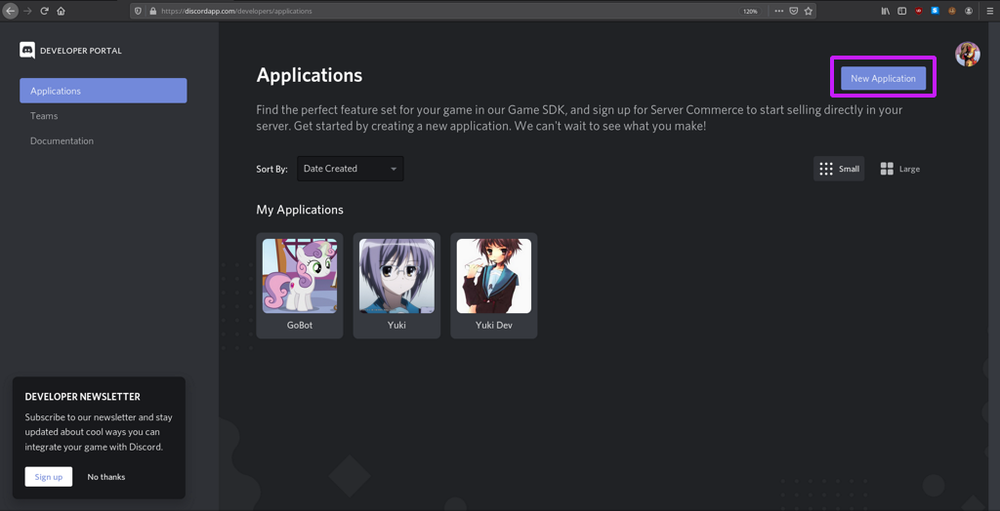
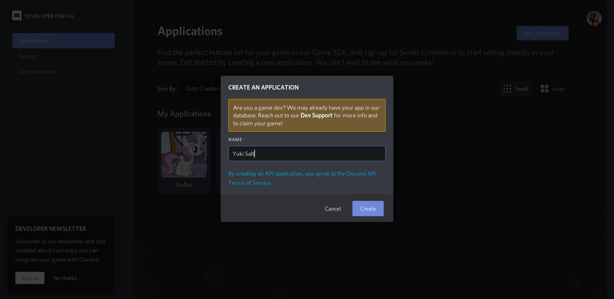
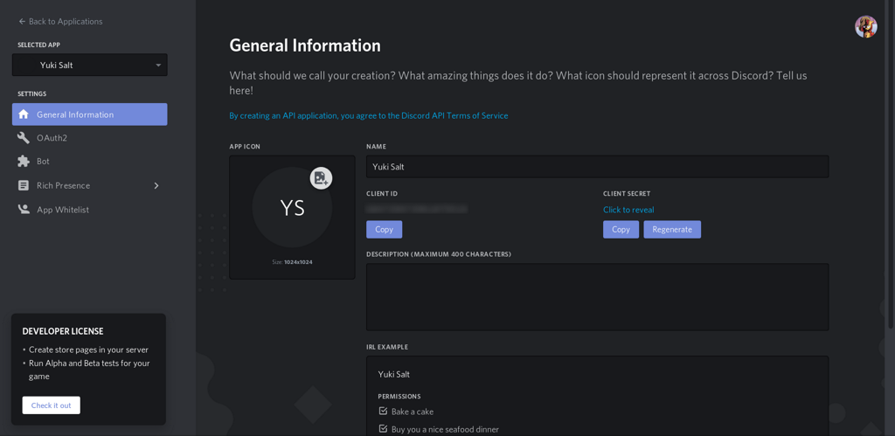
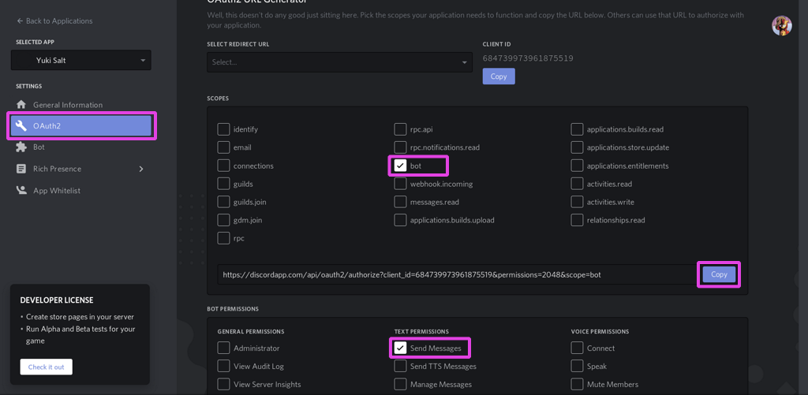

# Add Yuki to a Discord server

## Create a new discord application

First log in to discord and go to [https://discordapp.com/developers/applications](https://discordapp.com/developers/applications) and click on the `New Application` button on the top right corner.



Give it a name in the dialog that pops up and click `Create`.



After that, you should see dashboard for the new application.



## Start the bot

In the dashboard, click on the `bot` tab in the menu on the left. A prompt will ask you to confirm that you want to add a bot to the application.

Once you've done that, you should see a panel with your bot settings. Under `Build-A-Bot` -> `Token` you should see a button to copy the bot's token. Click it and the token will be copied to your clipboard.


When you have the token copied, open a terminal and go to the root of the yuki project.

First, you need to export the token as an environment variable with the name `BOT_TOKEN`

```bash
export BOT_TOKEN=<your token here>
```

Then you can start the bot by running the command underneath:

```bash
npm run dev
```

Once you see in the console the message `I am ready.`, the bot is up and running.

The only part left now is adding the bot to your server.

## Add the bot to your server

In the bot dashboard, select `OAuth2` in the menu on the left.

Scroll to `Scopes` and check `bot`.

Scroll to `Bot permissions` and check `Send Messages`.

Lastly, copy the url you have in `Scopes` and open it in a browser. It should open a window where you have the possibility to add the bot to any server you manage.




After that, the bot should be active on your server. You can try it by typint `@<name you gave to the app> joke`.

## Next step

Now we have the bot running in our local machine, but we would like to deploy it somewhere so that the bot keeps running when we turn off the computer (yeah, some people do that ¯\\\_(ツ)\_/¯).

Continue to [deploy bot to heroku](./deploy-bot-to-heroku.md) to learn more about that.
